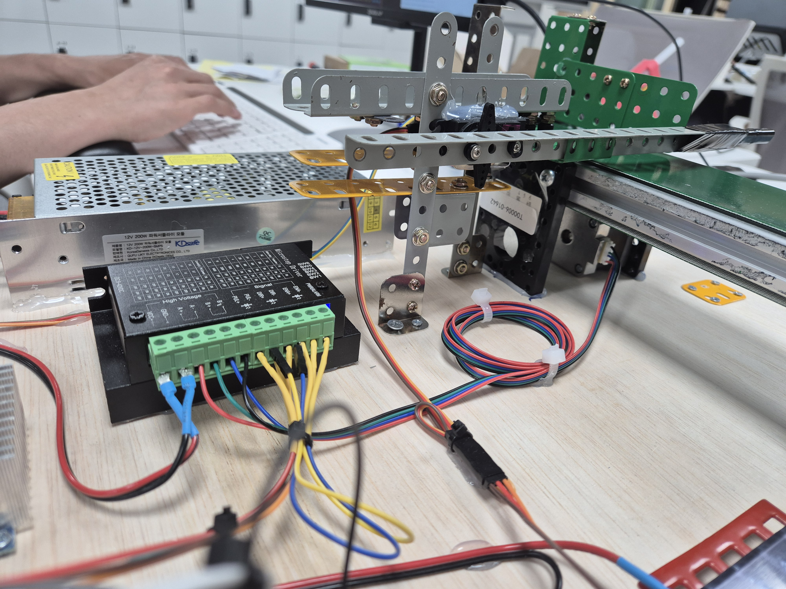
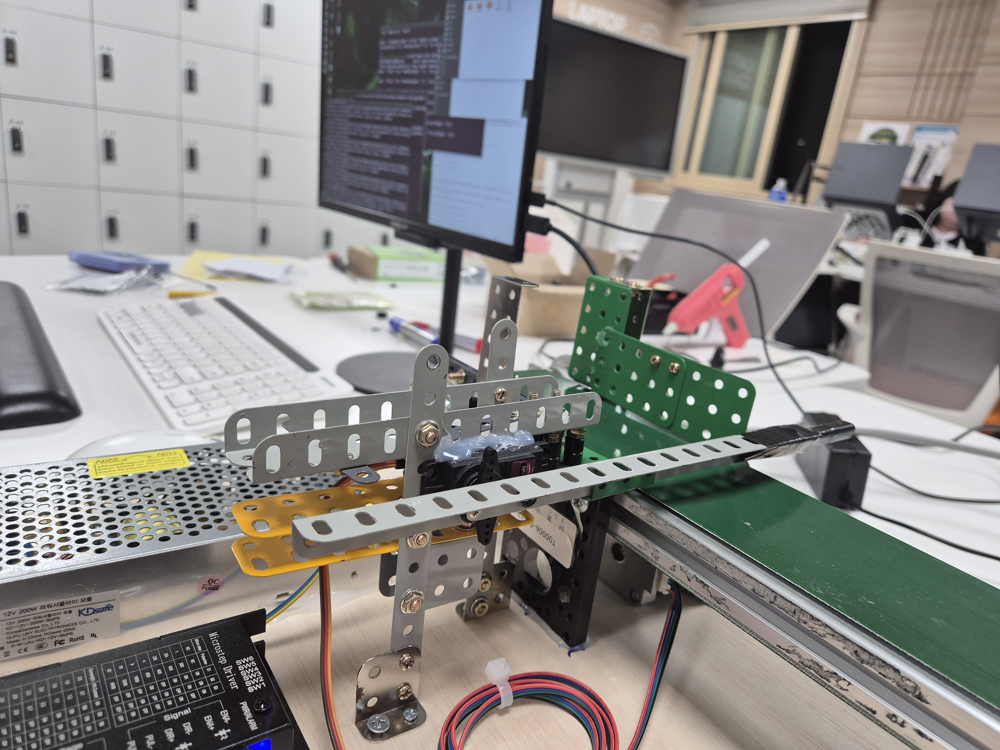
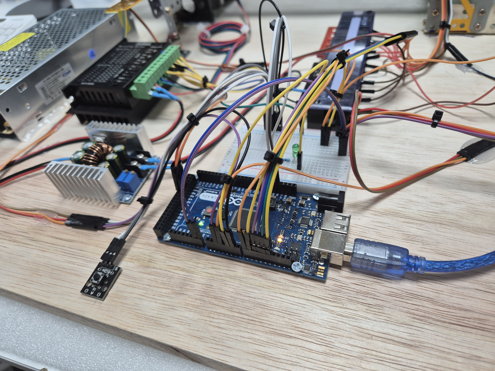
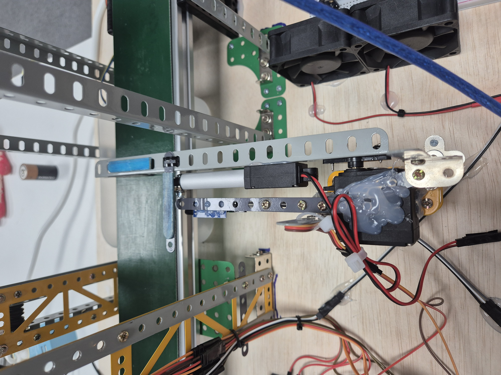
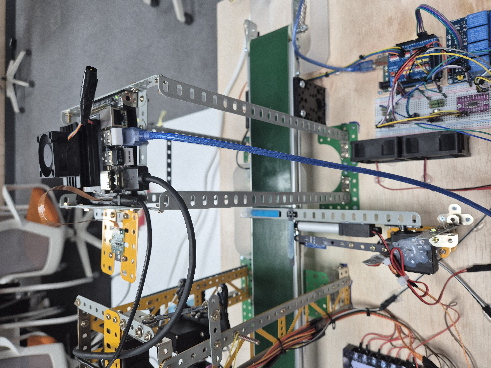
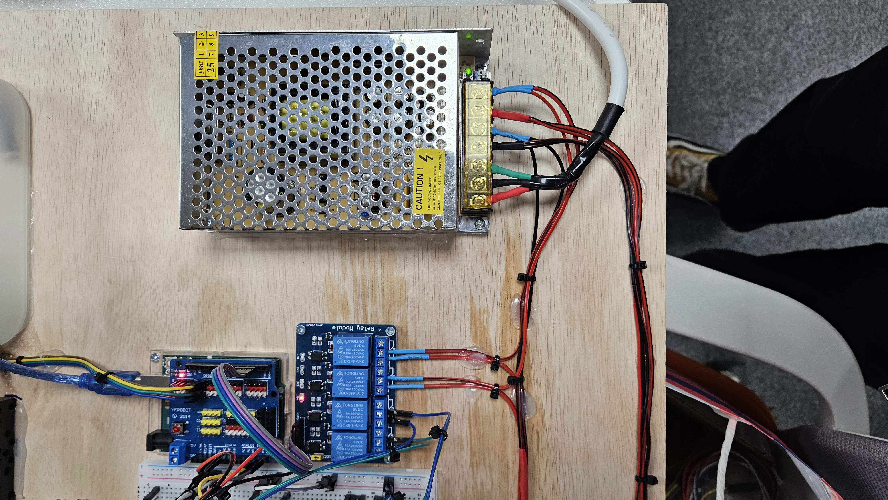
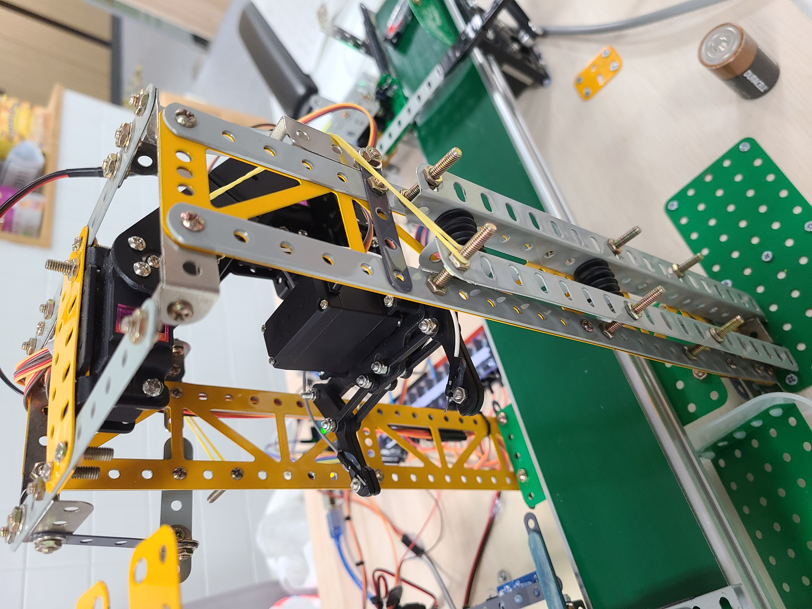
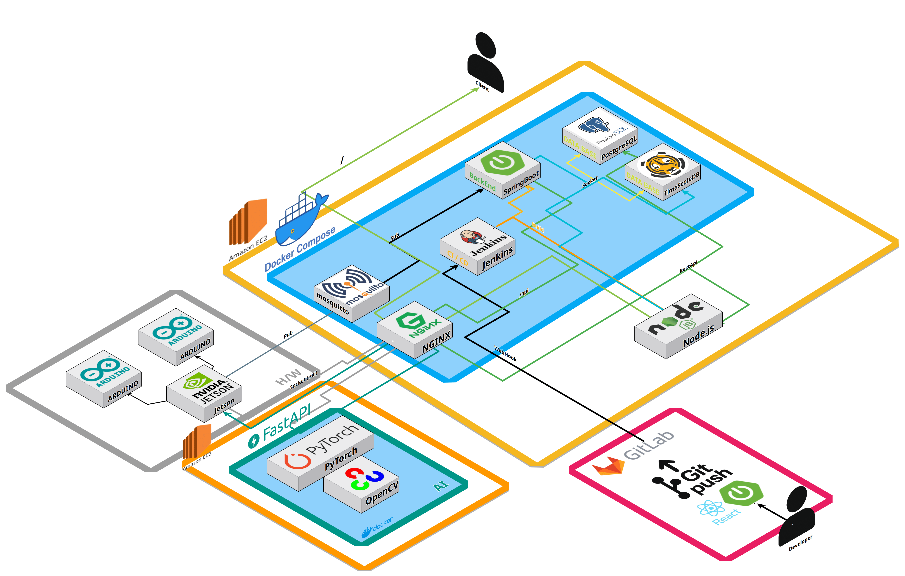
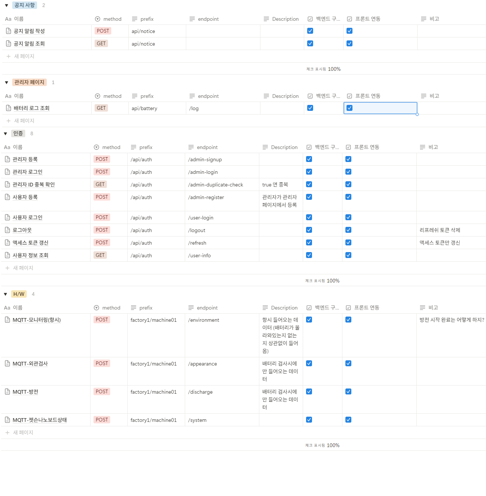
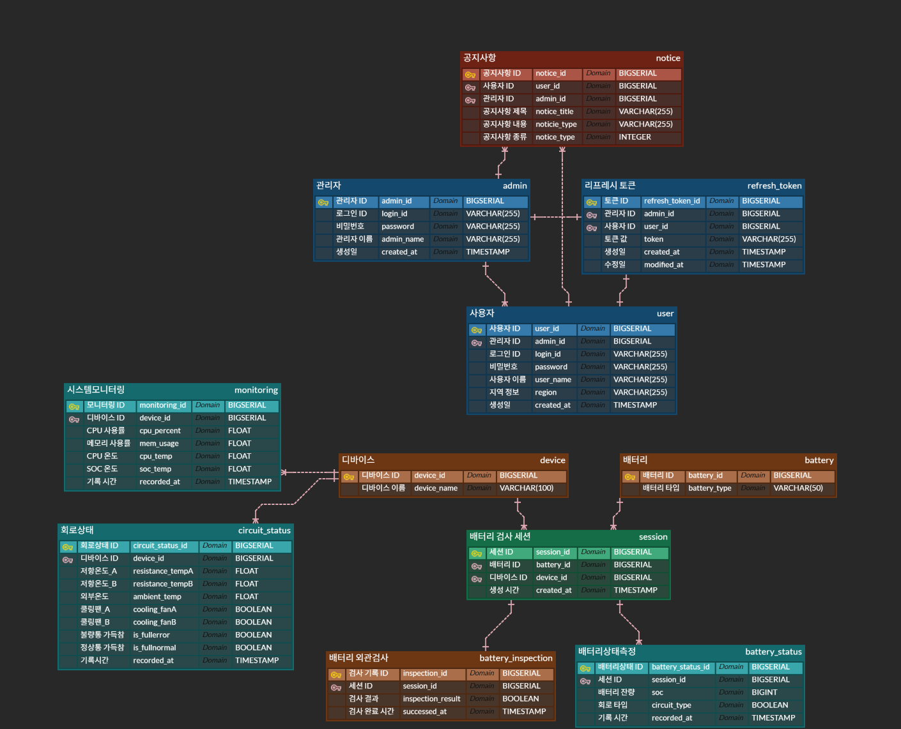

## 📋 목차

1. [서비스 소개](#-서비스-소개)
2. [팀원](#-팀원)
3. [주요 기능](#-주요-기능)
4. [주요 기술](#-주요-기술)
5. [산출물](#-산출물) (하드웨어, 아키텍쳐, API 명세서, ERD)
   
    

## 🔋 서비스 소개

### 🗓️ 프로젝트 기간 : 2025.04.14 ~ 2025.05.23 (6주)

</aside>

### 개요

**SSAFY 12기 2학기 자율 프로젝트**
**임베디드**

**CellCheck**는 **임베디드와 AI기술**을 이용한 폐건전지 분류 자동화 시스템입니다.

**CellCheck**는 **임베디드와 AI기술**을 활용하여 관리자가 상주하지 않아도 자동으로 폐건전지를 분류할 수 있는 시스템입니다.

사용자는 **CellCheck**를 활용해 폐건전지의 외관 검사, 잔류 전하 측정, 방전 등의 과정을 자동화할 수 있으며, 이를 통해 폐건전지로 발생하는 화재 위험을 줄일일 수 있습니다.
또한 시스템 관리자는 관리자 페이지를 통해 원격으로 시스템 상태를 확인할 수 있습니다.
 

## 🤝 팀원

<table>
  <tr>
    <td align="center" width="150px">
      
    </td>
    <td align="center" width="150px">
      
    </td>
    <td align="center" width="150px">
      
    </td>
    <td align="center" width="150px">
      
    </td>
    <td align="center" width="150px">
      
    </td>
    <td align="center" width="150px">
      
    </td>
  </tr>
  <tr>
    <td align="center">
      <a href="" target="_blank">
        강민석 Infra/BE/FE
      </a>
    </td>
    <td align="center">
      <a href="" target="_blank">
        김동욱 Embedded
      </a>
    </td>
    <td align="center">
      <a href="" target="_blank">
        김웅기 AI/FE
      </a>
    </td>
    <td align="center">
      <a href="" target="_blank">
        류현석 Embedded
      </a>
    </td>
    <td align="center">
      <a href="" target="_blank">
        이진형 Embedded
      </a>
    </td>
    <td align="center">
      <a href="">
        황홍법 Embedded
      </a>
    </td>
  </tr>
</table>

## 💻 주요 기능

<strong>👤사용자 페이지(토글을 눌러 펼쳐주세요)</strong>

- **외관 검사 모니터링**: 건전지 외관 검사 결과 및 배터리 타입(AA, AAA, C, D) 확인
- **방전 상태 모니터링**: 배터리 잔량(SoC) 및 방전 진행 상태 실시간 표시
- **배터리 통 상태**: 불량통/방전완료통 가득참 알림 확인
- **환경 모니터링**: 방전 회로 온도, 실내온도, 쿨링팬 작동 상태 표시
- **공지사항 확인**: 관리자가 등록한 시스템 점검, 긴급, 일반 공지 확인

<strong>🛠️관리자 페이지(토글을 눌러 펼쳐주세요)</strong>

- **시스템 모니터링**: Jetson Nano의 CPU/SOC 온도, CPU/메모리 사용률 실시간 확인
- **배터리 처리 현황**: 처리된 배터리 타입, 상태, 처리 결과 기록 조회
- **사용자 관리**: 시스템 사용자 등록 및 계정 정보 조회/관리
- **공지사항 등록**: 시스템 점검, 긴급, 일반 공지 등록 및 관리
- **배터리 통 알림**: 불량통/방전완료통 가득참 상태 알림 및 조치 안내

<strong>🔋 방전 기능 흐름</strong>

1. 로봇팔이 배터리를 **방전 회로에 연결** (핀을 통해 접촉).
2. **INA219 전류/전압 센서**를 통해 방전 중 **버스 전압과 전류**를 측정.
3. 측정된 값은 **I2C 통신**으로 **모니터링용 아두이노**에 전달됨.
4. 아두이노는 수신된 값으로부터 **로드 전압**을 계산.
5. **버스 전압, 로드 전압, 전류** 데이터를 **시리얼 통신**을 통해 **Jetson Nano**에 전송.
6. Jetson Nano는 이를 바탕으로 **SoC(잔여 충전량)** 계산 후, **MQTT 통신**으로 서버에 전송.
7. SoC가 기준 이하로 판단되면, Jetson Nano는 **방전 완료 메시지**를 **컨트롤러 아두이노**에 전달.
8. 아두이노는 **로봇팔을 제어**하여 배터리와 회로를 안전하게 분리.

<strong>🌡️ 과열 방지 기능 흐름</strong>

1. **방전 회로에 저항이 연결**되어 방전이 진행됨.
2. 저항의 온도는 **온도 센서**를 통해 **실시간 모니터링**됨.
3. 온도가 **지정 임계값 이상**이 되면, **릴레이를 제어**하여 **쿨링팬을 작동**시킴.
4. 온도가 **위험 수준 이상**이면, 해당 회로를 **릴레이로 차단하고** **다른 채널의 방전 회로로 전환**.
5. 과열된 회로의 온도가 정상 범위로 떨어지면, **다시 연결 가능 상태로 초기화**됨.

<strong>로봇팔 방전 제어 흐름</strong>

1. 카메라 사진의 **bbox 좌표**를 전달.
2. **bbox 좌표**를 받아서 **로봇팔 좌표계**로 변환.
3. 변환된 좌표를 **목표**로 로봇팔이 움직이도록 각각의 **서보모터의 각도**를 구함. 
4. **URDF(Unified Robot Description Format)**를 사용한 **역기구학(또는 직접 계산)**으로 각도를 구함.
5. 구한 **각도**를 **시리얼 통신**으로 아두이노에 전송.
6. 아두이노에서 각각의 **서보모터**를 **순서대로** 작동

<strong>로봇팔 복귀 제어 흐름</strong>

1. **방전 완료 신호**를 수신
2. **수신한 신호**에 맞춰서, 아두이노에 **시리얼 통신**으로로 **명령** 전달.
3. 아두이노에서 **받은 명령**대로 **서보모터 각 각도**를 **순서대로** 움직여서 **저장한 초기값**으로 복구.
4. **복귀 완료 후** 완료 보고를 **시리얼 통신**으로 보고.

## 🧑‍💻 주요 기술

### [ CellCheck ]

- **Embedded**
- **AI**

### [ FRONT ]
- **WebSocket/MQTT** - 실시간 데이터 통신 및 모니터링
- **Context API** - 전역 상태 관리 (배터리 데이터, 시스템 상태)
- **반응형 디자인** - 모바일/데스크톱 호환 UI

### [ BACK ]
- **WebSocket 서버** - 실시간 데이터 스트리밍
- **MQTT 브로커** - 임베디드 장치와 서버 간 통신
- **JWT 인증** - 사용자/관리자 권한 관리
- **시계열 데이터 관리** - 배터리 상태 및 시스템 모니터링 데이터 저장

### [ AI ]
- **Yolov8-seg**
- **OpenCV 기반 마스크 → bounding box 변환 및 비율 계산**

 

## 📦 산출물 (Deliverables)

<strong>1️⃣ 하드웨어 (Hardware)</strong>

| # | 사진 | 구성품 | 설명 |
|---|------|--------|------|
| 0 |  | **전체 시스템** | 주요 모듈이 한눈에 보이는 전경 |
| 1 |  | Power Supply | 200 W 12 V SMPS |
| 2 |  | 컨베이어&nbsp;/ 스텝모터 | 이송 모듈&nbsp;+ 드라이버 |
| 3 |  | MG946R Servo | 차단판 A 구동 |
| 4 |  | Arduino Mega | 모터·센서 제어 MCU |
| 5 |  | Servo + Actuator | 차단판 B & 불량 배출 |
| 6 |  | Jetson Nano | AI 추론 & 통합 제어 |
| 7 |  | Arduino + INA219 + GY-906 + Resistance | 방전회로 & 전류/전압 측정 & 온도 모니터링
| 8 |  | Arduino + Power Supply + Relay | 쿨링팬 전원 제어
| 9 |  | 4개의 MG996R Servo | 4자유도 알루미늄 로봇팔 제어

<strong>2️⃣ 시스템 문서(아키텍처, API 명세서, ERD)</strong>

| 문서 | 미리보기 |
|------|----------|
| 시스템 아키텍처 |  |
| API 명세서 |  |
| ERD  |  |

 
