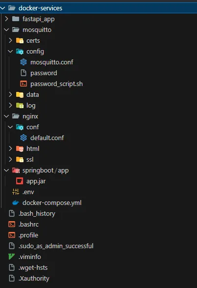

## 1. 개요

**Cell Check** 프로젝트는 **Spring Boot, Python, React**를 기반으로 개발되었습니다.

**Docker**와 **PostgreSQL(TimeScaleDB)**를 ****사용하였으며, **FastAPI 서버**, **PostgreSQL**, **스프링 서버**, **React**를 각각 컨테이너에 담아 배포하였습니다. 본 문서는 프로젝트를 배포하고 운영하는 방법을 설명합니다.

### 1.1. 프로젝트 사용 도구

```markdown
이슈 관리 : JIRA
형상 관리 : Gitlab
커뮤니케이션 : Notion, Meattermost
디자인 : React
CI/CD : PostgreSQL
```

### 1.2. 개발 환경

```markdown
# Fronend
React : RechartJs, TalewindJs
Visual Studio Code : 1.100.2

# Backend
Java 17
SpringBoot 3.4.5
JPA
PostgreSQL

# infra
Docker
DockerCompose
Jenkins
Nginx
Mosquitto

# AI
PyTorch
Tensorflow
OpenCV
FastAPI
Pandas
Numpy

```

[포팅메뉴얼.pdf](attachment:bca6aa21-f99c-4c2b-9ee5-b0c4629f8775:포팅메뉴얼.pdf)

## 2. 환경 설정

### 2.1 EC2에 필요한 프로그램 설치

EC2 서버에서 배포에 필요한 프로그램들을 설치합니다.

```bash
# 🔄 시스템 패키지 최신화
sudo apt update

# ☕ Java 설치 (Spring Boot 구동용)
sudo apt install openjdk-21-jdk -y  # Java 21 설치

# 🐳 Docker 설치
sudo apt install docker.io -y       # Docker 설치
sudo systemctl start docker         # Docker 서비스 시작
sudo systemctl enable docker        # 부팅 시 Docker 자동 시작

# 🐳 Docker Compose 설치
sudo curl -L "https://github.com/docker/compose/releases/download/1.27.4/docker-compose-$(uname -s)-$(uname -m)" -o /usr/local/bin/docker-compose
sudo chmod +x /usr/local/bin/docker-compose  # 실행 권한 부여

# 🔧 Git 설치 (Amazon Linux 기준 yum, Ubuntu는 apt 사용)
sudo apt install git -y             # Git 설치

# 🌐 Nginx 설치
sudo apt install nginx -y           # 웹 서버 설치

```

### 2-2 EC2 방화벽 설정

UFW를 이용해 배포에 필요한 포트를 오픈합니다.

```bash
# 🔓 포트 허용
sudo ufw allow 80        # HTTP
sudo ufw allow 443       # HTTPS
sudo ufw allow 8080      # Spring Boot (웹 포트)
sudo ufw allow 18080     # Jenkins

# ✅ 방화벽 활성화 및 상태 확인
sudo ufw enable
sudo ufw status

```

## 3. 배포 파일

### 3.1. DockerFile(Python)

```bash
# ✅ Python 3.9.13 slim 이미지 사용
FROM python:3.9.13-slim

# 필수 시스템 라이브러리 설치 (libGL 포함)
RUN apt-get update && apt-get install -y \
    libgl1 \
    libglib2.0-0 \
    && rm -rf /var/lib/apt/lists/*

# ✅ 작업 디렉토리 생성
WORKDIR /app

# ✅ 의존성 파일 먼저 복사
COPY requirements.txt .

# ✅ pip 업그레이드 및 의존성 설치
RUN pip install --upgrade pip \
    && pip install --no-cache-dir -r requirements.txt

# ✅ 전체 코드 복사
COPY . .

# ✅ 외부 포트 오픈 (WebSocket용 8000)
EXPOSE 8000

# ✅ WebSocket 서버 실행
CMD ["python", "run_server.py"]
```

### 3.2. Docker-Compose 파일

```bash
version: '3.8'

services:
  # PostgreSQL + TimescaleDB: 시계열 DB 기능이 추가된 PostgreSQL
  timescaledb:
    image: timescale/timescaledb:2.17.1-pg14
    container_name: timescaledb
    restart: always
    environment:
      POSTGRES_PASSWORD: ${POSTGRES_PASSWORD}
      POSTGRES_USER: ${POSTGRES_USER}
      POSTGRES_DB: ${POSTGRES_DB}
    ports:
      - "5432:5432" #호스트 <-> 컨테이너 포트 바인딩
    volumes:
      - timescaledb_data:/var/lib/postgresql/data # DB 지속적으로 볼륨 마운트
    networks:
      - app-network # 컨테이너끼리의 공통 네트워크 설정

  # Nginx
  nginx:
    image: nginx:1.26.3
    container_name: nginx
    restart: always
    ports:
      - "80:80" #HTTP
      - "443:443" #for HTTPS
    volumes:
      - ./nginx/html:/usr/share/nginx/html # 정적파일경로
      - ./nginx/conf:/etc/nginx/conf.d # Nginx 설정 파일
      - ./nginx/ssl:/etc/nginx/ssl 
    # depends_on:
    #   - springboot # 실행순서보장 (nginx 실행 전 실행)
    #   # - fastapi
    networks:
      - app-network
    
  # BE
  springboot:
    image: eclipse-temurin:17-jdk
    container_name: springboot-app
    restart: always
    ports:
      - "8080:8080"
    working_dir: /app #작업 디렉토리 설정
    volumes: 
      - ./springboot/app/app.jar:/app/app.jar
      - ./mosquitto/certs/ca.crt:/app/ca.crt # mqtt 통신을 위해 ca.crt 추가.
    command: ["java", "-jar", "app.jar"]
    environment:
      SPRING_PROFILES_ACTIVE: prod # 기본.yml 읽고 -prod 읽기
      SPRING_DATASOURCE_URL: ${SPRING_DATASOURCE_URL}
      SPRING_DATASOURCE_USERNAME: ${SPRING_DATASOURCE_USERNAME}
      SPRING_DATASOURCE_PASSWORD: ${SPRING_DATASOURCE_PASSWORD}
      SERVER_PORT: ${SERVER_PORT}
      DB_URL: ${DB_URL}
      DB_ID: ${DB_ID}
      DB_PASSWORD: ${DB_PASSWORD}
      JWT_SECRET: ${JWT_SECRET}
      HTTP_URL: ${HTTP_URL}
      HTTPS_URL: ${HTTPS_URL}
      SWAGGER_NAME: ${SWAGGER_NAME}
      SWAGGER_PWD: ${SWAGGER_PWD}
      MQTT_BROKER: ${MQTT_BROKER}
      MQTT_USERNAME: ${MQTT_USERNAME}
      MQTT_PASSWORD: ${MQTT_PASSWORD}
      MQTT_CERTPATH: ${MQTT_CERTPATH}

    depends_on:
      - timescaledb
    networks:
      - app-network
  
  # MQTT 브로커 (H/W 통신용)
  mosquitto:
    image: eclipse-mosquitto:2.0.18
    container_name: mosquitto
    restart: always
    ports:
      - "1883:1883" # 기본
      - "8883:8883" # TLS 
    volumes:
      - ./mosquitto/config:/mosquitto/config
      - ./mosquitto/data:/mosquitto/data
      - ./mosquitto/log:/mosquitto/log
      - ./mosquitto/certs:/mosquitto/certs
    networks:
      - app-network
  
  # Jenkins: CI/CD
  jenkins:
    image: jenkins/jenkins:lts-jdk17 # JDK 17 기반 LTS
    container_name: jenkins
    restart: always
    ports:
      - "8088:8080" # WebUI
      - "50000:50000" # 빌드 노드 연결
    volumes:
      - jenkins_home:/var/jenkins_home
      - /var/run/docker.sock:/var/run/docker.sock # 소켓마운트
      - /usr/bin/docker:/usr/bin/docker # 바이너리 마운트
      - /usr/bin/docker-compose:/usr/local/bin/docker-compose # Docker Compose 바이너리 마운트
      - /home/ubuntu/docker-services:/home/ubuntu/docker-services # 호스트와 컨테이너 간 공유 디렉토리
    environment:
      - DOCKER_HOST=unix:///var/run/docker.sock # Docker 호스트 설정
      - DOCKER_GROUP_ID=${DOCKER_GROUP_ID}
      - JENKINS_OPTS="--prefix=/jenkins"
    user: root 
    group_add:
      - ${DOCKER_GROUP_ID}
    networks:
      - app-network

# 공통 네트워크
networks:
  app-network:
    driver: bridge
    
# 볼륨 정의
volumes:
  timescaledb_data:
  jenkins_home:
  grafana_data:
  portainer_data:
  
```

### 3.3 Jenkins 파일

- SpringBoot
    
    ```bash
    	pipeline {
        agent any
    
        environment {
            // 도커 관련 설정
            DOCKER_IMAGE = credentials('SPRING_IMAGE')
            DOCKER_CONTAINER = credentials('SPRING_CONTAINER')
            DOCKER_PORT = credentials('SPRING_PORT')
            DOCKER_PATH = credentials('DOCKER_PATH')
    
            // EC2 관련 설정
            EC2_USER = credentials('EC2_USER')
            EC2_IP = credentials('EC2_IP')
            SSH_KEY = credentials('SSH_KEY')
    
            // 데이터베이스 자격 증명
            DB_URL = credentials('DB_URL')
            DB_USERNAME = credentials('DB_USERNAME')
            DB_PASSWORD = credentials('DB_PASSWORD')
    
            // Java 및 Gradle 경로 설정
            JAVA_HOME = '/opt/java/openjdk'
            GRADLE_HOME = '/opt/gradle/gradle-8.13'
            PATH = "${JAVA_HOME}/bin:${GRADLE_HOME}/bin:${env.PATH}"
        }
    
        tools {
            jdk 'JDK17'
            gradle 'Gradle 8.13'
        }
    
        stages {
            stage('Clone Repository') {
                steps {
                    echo '저장소 복제 중...'
                    checkout scm
                }
            }
    
            stage('Build Application') {
                steps {
                    echo 'Gradle로 애플리케이션 빌드 중...'
                    dir('back/cellcheck') {
                        sh 'chmod +x ./gradlew'
                        sh './gradlew clean build -x test'
                        sh 'ls -la build/libs'
                    }
                }
            }
    
            stage('Deploy with Docker Compose') {
                steps {
                    echo 'Docker Compose로 배포 중...'
    
                    //docker_path 경로확인
                    sh 'echo "DOCKER_PATH = ${DOCKER_PATH}"'
                    //sh 'find / -name app.jar -type f 2>/dev/null'
    
                    // JAR 파일을 Docker Compose 볼륨 경로로 복사
                    sh 'mkdir -p /home/ubuntu/docker-services/springboot/app'
                    sh 'cp back/cellcheck/build/libs/cellcheck-0.0.1-SNAPSHOT.jar /home/ubuntu/docker-services/springboot/app/app.jar'
    
                    // 파일 권한 설정
                    sh 'chmod 644 /home/ubuntu/docker-services/springboot/app/app.jar'
    
                    sh '''
                        cd /home/ubuntu/docker-services
                        /usr/bin/docker stop springboot-app || true
                        /usr/bin/docker rm springboot-app || true
                        /usr/local/bin/docker-compose up -d springboot
                    '''
    
                }
            }
        }
    
        post {
            success {
                echo '배포가 성공적으로 완료되었습니다!'
            }
            failure {
                echo '배포에 실패했습니다.'
            }
        }
    }
    
    ```
    
- React
    
    ```bash
    pipeline {
        agent any
        tools {
            nodejs 'node18'
        }
        environment {
            GIT_CREDENTIALS_ID = 'GitLab-PAT'
            FRONT_PROJECT_DIR = "cellcheck-fe"
            DIST_DIR = "cellcheck-fe/dist"
            NGINX_HTML_DIR = "/home/ubuntu/docker-services/nginx/html"
        }
        stages {
            stage('Checkout Code') {
                steps {
                    checkout([
                        $class: 'GitSCM',
                        branches: [[name: 'develop-fe']],
                        userRemoteConfigs: [[
                            url: 'https://lab.ssafy.com/s12-final/S12P31D106',
                            credentialsId: "${GIT_CREDENTIALS_ID}" // 'GitLab-PAT' ID 사용
                        ]]
                    ])
                    sh 'echo "✅ 코드 체크아웃 완료"'
                }
            }
    
            
            stage('Build Frontend') {
                steps {
                    dir("${FRONT_PROJECT_DIR}") {
                        sh '''
                        echo "✅ 프론트엔드 빌드 시작"
                        rm -rf node_modules dist
                        npm install --legacy-peer-deps
                        npm run build
                        echo "✅ 프론트엔드 빌드 완료"
                        '''
                    }
                }
            }
            
            stage('Deploy to Nginx') {
                steps {
                    sh """
                    echo "[INFO] Nginx 디렉토리 생성..."
                    mkdir -p ${NGINX_HTML_DIR}
                    
                    echo "[INFO] 기존 파일 삭제 중..."
                    rm -rf ${NGINX_HTML_DIR}/*
                    
                    echo "[INFO] 새로운 빌드 파일 복사 중..."
                    cp -r ${DIST_DIR}/* ${NGINX_HTML_DIR}/
                    
                    echo "[INFO] 권한 설정..."
                    chmod -R 755 ${NGINX_HTML_DIR}
                    
                    echo "[INFO] Nginx 컨테이너 재시작 중..."
                    cd /home/ubuntu/docker-services
                    docker restart nginx
                    echo "[INFO] 배포 완료 ✅"
                    """
                }
            }
        }
        
        post {
            success {
                echo "🎉 배포가 성공적으로 완료되었습니다!"
            }
            failure {
                echo "❌ 배포 중 오류가 발생했습니다."
            }
        }
    }
    ```
    

### 3.4 Nginx.conf 파일

```bash
server {
    listen 80 default_server;
    server_name _;
    
    # Let's Encrypt 인증서 갱신을 위한 경로
    location ^~ /.well-known/acme-challenge/ {
        root /var/www/html;
    }
    
    # HTTP를 HTTPS로 리다이렉트
    location / {
        return 301 https://$host$request_uri;
    }
}

server {
    listen 443 ssl http2;
    server_name _;
    
    # SSL 설정
    ssl_certificate /etc/nginx/ssl/fullchain.pem;
    ssl_certificate_key /etc/nginx/ssl/privkey.pem;
    ssl_protocols TLSv1.2 TLSv1.3;
    ssl_prefer_server_ciphers on;
    ssl_ciphers ECDHE-RSA-AES256-GCM-SHA512:DHE-RSA-AES256-GCM-SHA512:ECDHE-RSA-AES256-GCM-SHA384:DHE-RSA-AES256-GCM-SHA384;
    
    # 프록시 헤더 설정
    proxy_set_header Host $http_host;
    proxy_set_header X-Real-IP $remote_addr;
    proxy_set_header X-Forwarded-For $proxy_add_x_forwarded_for;
    proxy_set_header X-Forwarded-Proto $scheme;
    
    # 기본 CORS 설정
    add_header 'Access-Control-Allow-Origin' '*' always;
    add_header 'Access-Control-Allow-Methods' 'GET, POST, PUT, DELETE, PATCH, OPTIONS' always;
    add_header 'Access-Control-Allow-Headers' 'DNT,User-Agent,X-Requested-With,If-Modified-Since,Cache-Control,Content-Type,Range,Authorization' always;
    add_header 'Access-Control-Expose-Headers' 'Content-Length,Content-Range' always;
    
    # React 애플리케이션을 위한 정적 파일 서빙
    location / {
        # 프리플라이트 요청 처리
        if ($request_method = 'OPTIONS') {
            add_header 'Access-Control-Allow-Origin' '*';
            add_header 'Access-Control-Allow-Methods' 'GET, POST, PUT, DELETE, PATCH, OPTIONS';
            add_header 'Access-Control-Allow-Headers' 'DNT,User-Agent,X-Requested-With,If-Modified-Since,Cache-Control,Content-Type,Range,Authorization';
            add_header 'Access-Control-Max-Age' 1728000;
            add_header 'Content-Type' 'text/plain; charset=utf-8';
            add_header 'Content-Length' 0;
            return 204;
        }
        
        root /usr/share/nginx/html;
        index index.html index.htm;
        try_files $uri $uri/ /index.html;
    }
    # Jenkins 서비스 프록시
    location /jenkins/ {
        # 프리플라이트 요청 처리
        if ($request_method = 'OPTIONS') {
            add_header 'Access-Control-Allow-Origin' '*';
            add_header 'Access-Control-Allow-Methods' 'GET, POST, PUT, DELETE, PATCH, OPTIONS';
            add_header 'Access-Control-Allow-Headers' 'DNT,User-Agent,X-Requested-With,If-Modified-Since,Cache-Control,Content-Type,Range,Authorization';
            add_header 'Access-Control-Max-Age' 1728000;
            add_header 'Content-Type' 'text/plain; charset=utf-8';
            add_header 'Content-Length' 0;
            return 204;
        }
        
        proxy_pass http://jenkins:8080;
        proxy_http_version 1.1;
        proxy_set_header Host $host;
        proxy_set_header X-Real-IP $remote_addr;
        proxy_set_header X-Forwarded-For $proxy_add_x_forwarded_for;
        proxy_set_header X-Forwarded-Proto $scheme;
        proxy_set_header X-Forwarded-Host $host;
        proxy_set_header X-Forwarded-Port $server_port;
        proxy_set_header X-Forwarded-Prefix /jenkins; 
        proxy_redirect default; #리다이렉트트

        # 웹소켓
        proxy_set_header Upgrade $http_upgrade;
        proxy_set_header Connection "upgrade";
        proxy_read_timeout 86400;

        # 쿠키 경로
        proxy_cookie_path /jenkins /jenkins;
    }
    
    # Spring Boot API 요청 프록시
    location /api {
        # 프리플라이트 요청 처리
        if ($request_method = 'OPTIONS') {
            add_header 'Access-Control-Allow-Origin' '*';
            add_header 'Access-Control-Allow-Methods' 'GET, POST, PUT, DELETE, PATCH, OPTIONS';
            add_header 'Access-Control-Allow-Headers' 'DNT,User-Agent,X-Requested-With,If-Modified-Since,Cache-Control,Content-Type,Range,Authorization';
            add_header 'Access-Control-Max-Age' 1728000;
            add_header 'Content-Type' 'text/plain; charset=utf-8';
            add_header 'Content-Length' 0;
            return 204;
        }
        
        proxy_pass http://springboot:8080;
        proxy_http_version 1.1;
        proxy_set_header Upgrade $http_upgrade;
        proxy_set_header Connection "upgrade";
        proxy_read_timeout 86400;  # WebSocket 연결 타임아웃 설정 (24시간)
    }

    # Swagger UI 경로 설정
    location ~ ^/(swagger-ui|v3/api-docs) {
        # 프리플라이트 요청 처리
        if ($request_method = 'OPTIONS') {
            add_header 'Access-Control-Allow-Origin' '*';
            add_header 'Access-Control-Allow-Methods' 'GET, POST, PUT, DELETE, PATCH, OPTIONS';
            add_header 'Access-Control-Allow-Headers' 'DNT,User-Agent,X-Requested-With,If-Modified-Since,Cache-Control,Content-Type,Range,Authorization';
            add_header 'Access-Control-Max-Age' 1728000;
            add_header 'Content-Type' 'text/plain; charset=utf-8';
            add_header 'Content-Length' 0;
            return 204;
        }
        
        proxy_pass http://springboot:8080;
        proxy_http_version 1.1;
        proxy_set_header Host $host;
        proxy_set_header X-Real-IP $remote_addr;
        proxy_set_header X-Forwarded-For $proxy_add_x_forwarded_for;
        proxy_set_header X-Forwarded-Proto $scheme;
    }
    
    location /ai {
        proxy_pass http://18.179.245.89:8000;

        proxy_http_version 1.1;
        proxy_set_header Upgrade $http_upgrade;
        proxy_set_header Connection "upgrade";

        proxy_set_header Host $host;
        proxy_set_header X-Real-IP $remote_addr;

        proxy_read_timeout 86400;

        # CORS 대응
        add_header 'Access-Control-Allow-Origin' '*';
        add_header 'Access-Control-Allow-Methods' 'GET, POST, PUT, DELETE, PATCH, OPTIONS';
        add_header 'Access-Control-Allow-Headers' 'DNT,User-Agent,X-Requested-With,If-Modified-Since,Cache-Control,Content-Type,Range,Authorization';

        if ($request_method = 'OPTIONS') {
            return 204;
        }
    }
    # # FastAPI 서비스 프록시
    # location /fastapi {
    #     # 프리플라이트 요청 처리
    #     if ($request_method = 'OPTIONS') {
    #         add_header 'Access-Control-Allow-Origin' '*';
    #         add_header 'Access-Control-Allow-Methods' 'GET, POST, PUT, DELETE, PATCH, OPTIONS';
    #         add_header 'Access-Control-Allow-Headers' 'DNT,User-Agent,X-Requested-With,If-Modified-Since,Cache-Control,Content-Type,Range,Authorization';
    #         add_header 'Access-Control-Max-Age' 1728000;
    #         add_header 'Content-Type' 'text/plain; charset=utf-8';
    #         add_header 'Content-Length' 0;
    #         return 204;
    #     }
        
    #     proxy_pass http://fastapi:8000;
    #     proxy_http_version 1.1;
    #     proxy_set_header Upgrade $http_upgrade;
    #     proxy_set_header Connection "upgrade";
    #     proxy_read_timeout 86400;  # WebSocket 연결 타임아웃 설정 (24시간)
    # }
}

```

### 3.6. Mosquitto.conf 파일

```bash
persistence true
persistence_location /mosquitto/data/
log_dest file /mosquitto/log/mosquitto.log
log_type all

listener 1883
protocol mqtt
allow_anonymous false

listener 8883
protocol mqtt
cafile /mosquitto/certs/ca.crt
certfile /mosquitto/certs/server.crt
keyfile /mosquitto/certs/server.key
require_certificate false
allow_anonymous false
password_file /mosquitto/config/password
```

### 3.5. 환경 변수 설정(.env 파일)

```bash
# JWT 설정
JWT_SECRET=s8dF4jKl2mP9qR7tZ5xV3wY1bN6cA0uewqw

#Server
SERVER_PORT=8080

#DB
DB_URL_LOCAL=jdbc:postgresql://k12d106.p.ssafy.io:5432/cellcheck?ssl=false&TimeZone=Asia/Seoul
DB_URL=jdbc:postgresql://timescaledb:5432/cellcheck?ssl=false&TimeZone=Asia/Seoul
DB_ID=k106
DB_PASSWORD=cellcheck123!

# 아래는 EC2 .env
POSTGRES_PASSWORD=cellcheck123!
POSTGRES_USER=k106
POSTGRES_DB=cellcheck

DOCKER_GROUP_ID=122

# springboot 설정들
SPRING_DATASOURCE_URL=jdbc:postgresql://timescaledb:5432/cellcheck?ssl=false&TimeZone=Asia/Seoul
SPRING_DATASOURCE_USERNAME=k106
SPRING_DATASOURCE_PASSWORD=cellcheck123!

HTTP_URL=http://k12d106.p.ssafy.io
HTTPS_URL=https://k12d106.p.ssafy.io

SWAGGER_NAME=redlaw553
SWAGGER_PWD=cellcheck553!

MQTT_BROKER=ssl://k12d106.p.ssafy.io:8883
MQTT_USERNAME=cellcheck
MQTT_PASSWORD=ssafy123!
MQTT_CERTPATH=/app/ca.crt
```

**보안 주의사항**

- .gitignore에 환경변수 및 민감정보는 등록해둬야함
- 효과적인 개발 흐름을 위해 application-local.yaml 파일을 .gitignore로 등록해두고 직접 경로 설정, 이외 환경변수는 EC2에 직접 환경변수 파일에 추가

## 4. 서버 배포 (EC2)

- 처음부터 로컬에서 작업하는것이 아닌 VSCODE의 `Remote-SSH`를 이용해 서버 내에서 직접 파일 작업
- /home/ubuntu/docker-services 디렉토리 생성후 이곳에 기본적인 파일들 작업

  

- AI 모델이 GPU가 필요함에 따라 새로이 G6-xlarge 및 프리티어 ubuntu 모델을 인스턴스 생성
    - 해당 EC2서버 포트는 8000포트에 기본 제공 EC2 서버 public IP를 등록하여 Nginx proxy pass를 통해 진입하여 묶음

## 5. 배포 흐름

- docker-compose up 명령어 실행을 통해 필요한 컨테이너들 (**Springboot, TimeScaleDB, Jenkins,Nginx, Mosquitto)** 을 실행
- 개발자가 develop-back 혹은 develop-fe브랜치에 코드를 푸시
- GitLAb Webhook의 푸시 이벤트를 감지하여 각각 Jenkins에 전달
- Jenkins는 해당 이벤트에따라 트리거가 발생한 브랜치를 기반으로 **Springboot** 혹은 **React**를 빌드
- 빌드된 **.jar** 혹은 **node.js**를 기반으로 새로운 컨테이너 생성